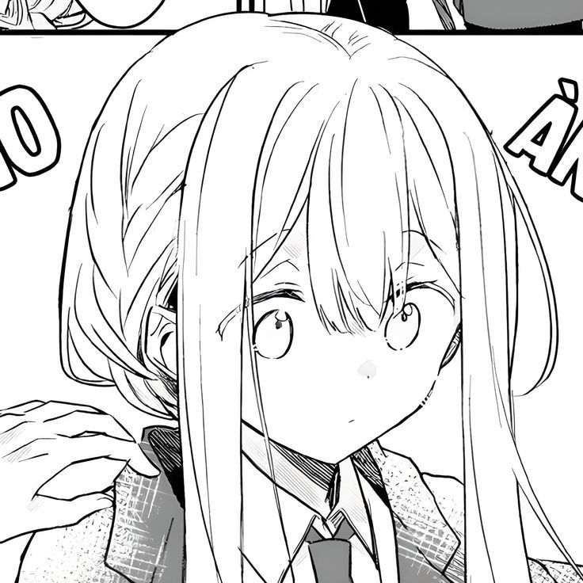

<div align="center">
  
  
  # Endless Melody's Grimoire
  
  **AI-Powered & Magical Anime Portfolio**
  
  *Bridging the gap between ancient arcane aesthetics and modern web development*
  
  <p>
    
    
    
    
    
  </p>

  <p>
    <a href="https://github.com/EndlessMelody/Portfolio">Live Demo</a> • 
    <a href="#about">Documentation</a> • 
    <a href="https://github.com/EndlessMelody/Portfolio/issues">Report Issues</a>
  </p>
</div>

---

## About

A timeless personal portfolio with an edgy, high-fantasy anime aesthetic — featuring Grimoire 3D project books, mysterious HUDs, and ambient audio — built on **Next.js 14**, **TypeScript**, and **SCSS modules**.

> Crafted with floating sakura petals, RPG-style skill bars, cursor sparkles, and a deep "arcane night" dark mode.

## 🧰 Tech stack

| Layer | Choice |
|---|---|
| Framework | Next.js 14 (App Router) |
| Language | TypeScript |
| Styling | SCSS Modules + custom tokens |
| Animations | CSS keyframes + Framer Motion (available) |
| Icons | Lucide React |
| Design system | Once UI (`@once-ui-system/core`) — installed, ready to extend |
| Fonts | Zen Maru Gothic (display), Inter (body) — via `next/font/google` |

## 🚀 Quick start

```bash
npm install
npm run dev
```

Open http://localhost:3000

## 📁 Project structure

```
.
├── app/
│   ├── layout.tsx          # Root, fonts, providers
│   ├── page.tsx            # Single-page assembly of sections
│   ├── globals.scss        # Imports theme + animations + base
│   ├── theme.scss          # Color tokens, light + dark mode
│   └── animations.scss     # Reusable keyframes
├── components/
│   ├── providers/ThemeProvider.tsx
│   ├── layout/             # Navbar, Footer, ThemeToggle
│   ├── effects/            # SakuraPetals, CursorSparkles
│   ├── sections/           # Hero, About, Skills, Projects, Experience, Contact
│   └── ui/                 # ProjectCard, SectionDivider
├── lib/data.ts             # All portfolio content (✏️ edit this)
├── public/
│   ├── avatar.svg          # Placeholder anime portrait
│   └── favicon.svg
└── ...
```

## ✏️ How to customise

1. **Your info** — edit `lib/data.ts` (name, bio, skills, projects, experience, socials).
2. **Avatar** — replace `public/avatar.svg` with your own anime portrait (PNG/JPG/SVG).
3. **Resume** — drop your PDF in `public/resume.pdf` (linked from About section).
4. **Colors** — tweak `app/theme.scss`:
   - `--pink-*`, `--blue-*`, `--lavender-*` for accents
   - `[data-theme="light"]` / `[data-theme="dark"]` for mode-specific values
5. **Sections** — comment out any section in `app/page.tsx` to disable.
6. **Anime touches** — toggle in `app/layout.tsx` (`SakuraPetals`, `CursorSparkles`).

## 🌗 Theme tokens

The pastel palette uses CSS custom properties exposed in `:root`. To rebrand:

```scss
:root {
  --pink-400: #ff9fb8;   // primary CTA
  --blue-400: #7fb3ff;   // secondary CTA
  --lavender-300: #c8b6ff;
}
```

Both light and dark modes inherit these and remap semantic tokens (`--bg-base`, `--text-primary`, etc.).

## 📦 Deployment

Designed for one-click deploy on **Vercel** or **Netlify**.

```bash
npm run build
```

## 📝 Notes

- The contact form opens the user's mail client by default. Swap to an API (Resend, Formspree, etc.) in `Contact.tsx` when ready.
- Animations respect `prefers-reduced-motion`.
- Cursor sparkles only render on fine-pointer devices.

## 💌 License

MIT — feel free to fork and remix. Keep the kindness, please ✿
